# Offline Password Manager 🔑

## Technologies ⚙️

- Kotlin, Jetpack Compose
- Room DB, SQLCipher, Hilt, Jetpack DataStore

## Features 📲

- 🎨 Material 3 & Material You
- 📷 Add Images in Passwords 
- 💻 Adaptive UI Support for Foldables & Tablets
- 🔐 Offline & Completely Encrypted 
- 🗝️ Password Generator to create Strong Passwords
- 💾 Import/Export Your Data With Encryption
- 🔓 Use Biometric or Screen Lock Password to Unlock
- 📂 Use Categories to Organize your Passwords
- ⏬ Filter Passwords Based on Category
- 📃Custom Sort Order by Name or When Last Updated
- ⌚ Wear OS Support with secure end-to-end encryption
- 🔒 Auto App Lock
- 🎹 Password Autofill Support
- 🌐 Add Website Address for each password entry

## Running The Application 🧑🏻‍💻
- `git clone https://github.com/jagadeesh-k-2802/password-manager-compose`
- Open the directory in Android Studio
- Place your secret key for encryption in `./wear/secrets.defaults.properties` and remove the `defaults`
- Click run as you would do with any other project

## Screenshots (Phone) 📷

| | | |
|---|---|---|
| 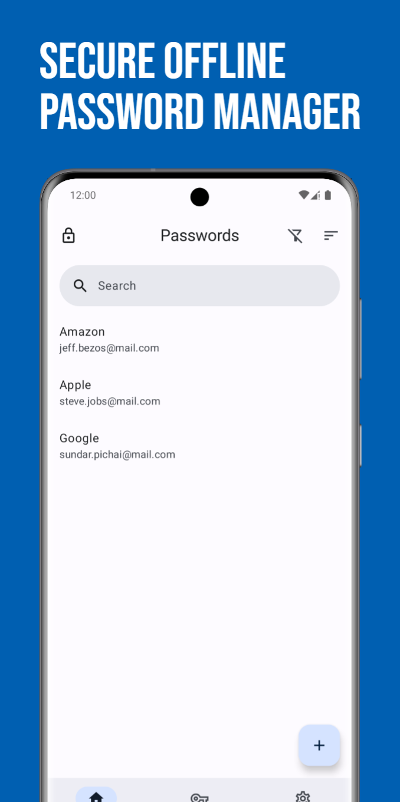 | 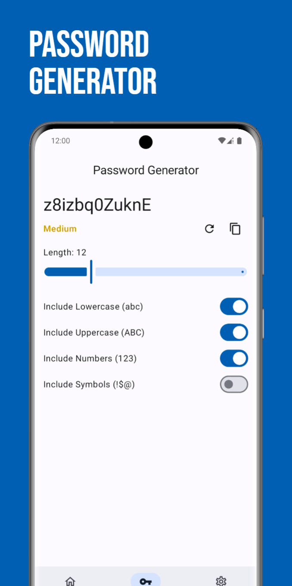 | 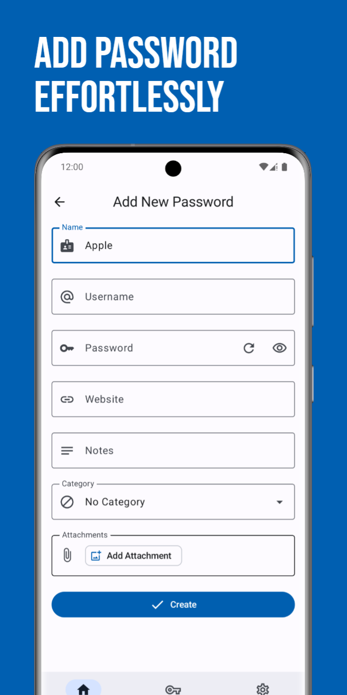 |
| 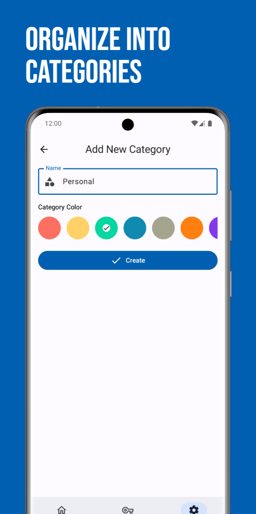 | 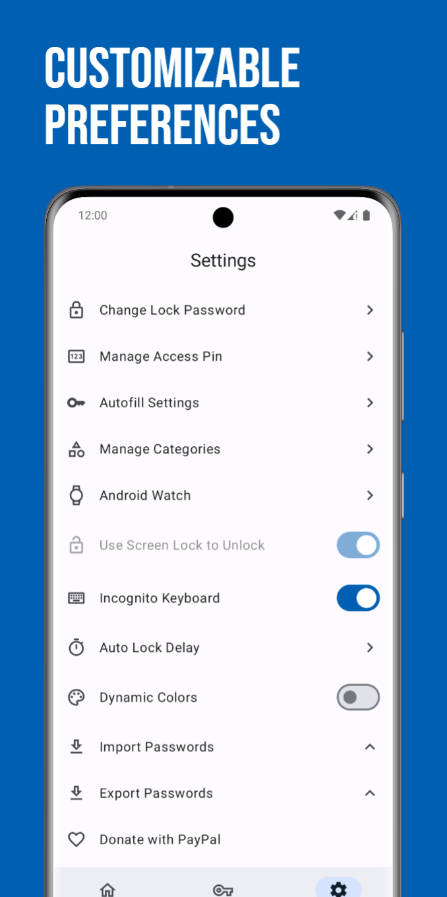 | 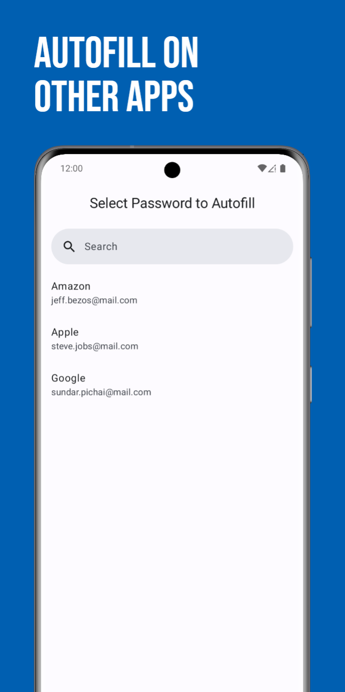 |
| 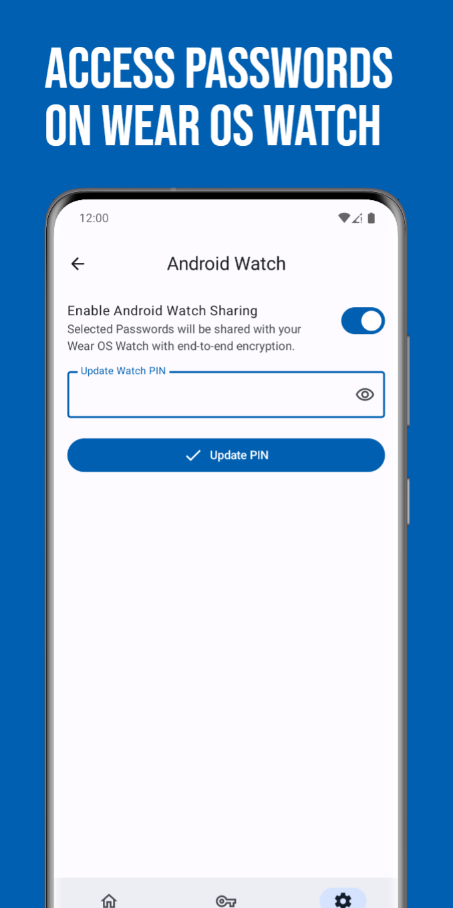 |  |  |

## Screenshots (Tablet) 💻

| |
|---|
| 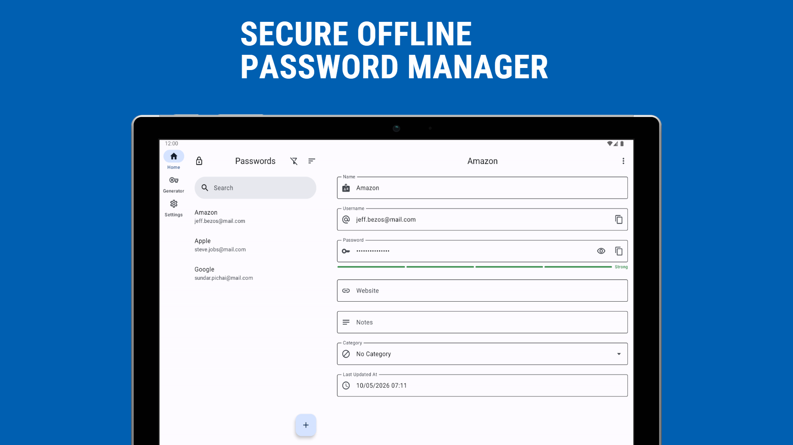 |
| 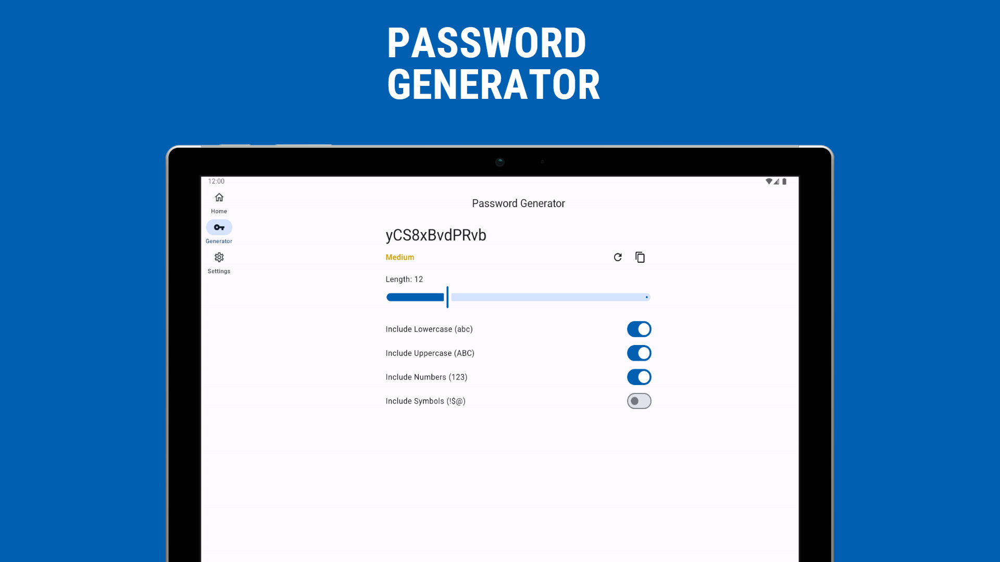 |
| 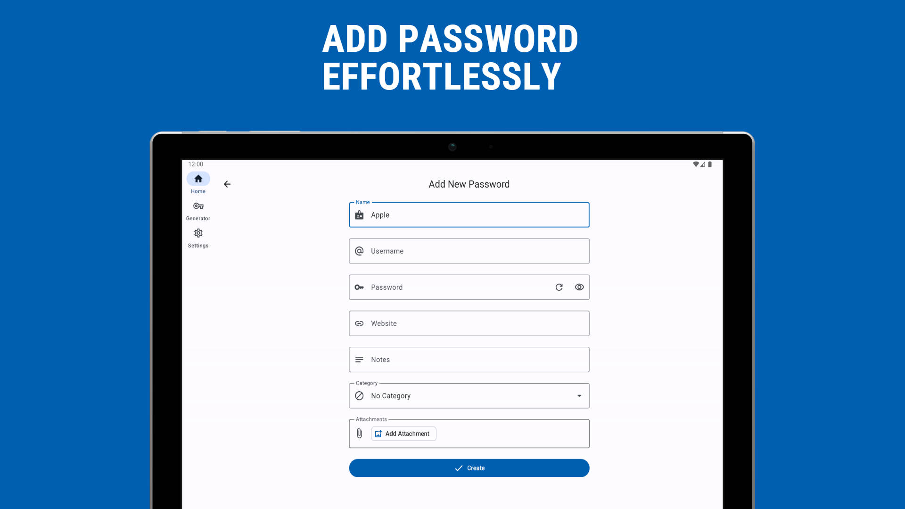 |
| 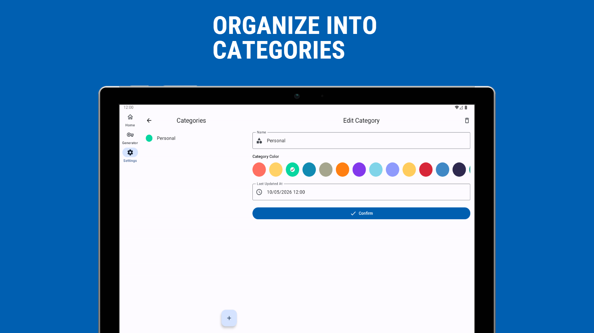 |
| 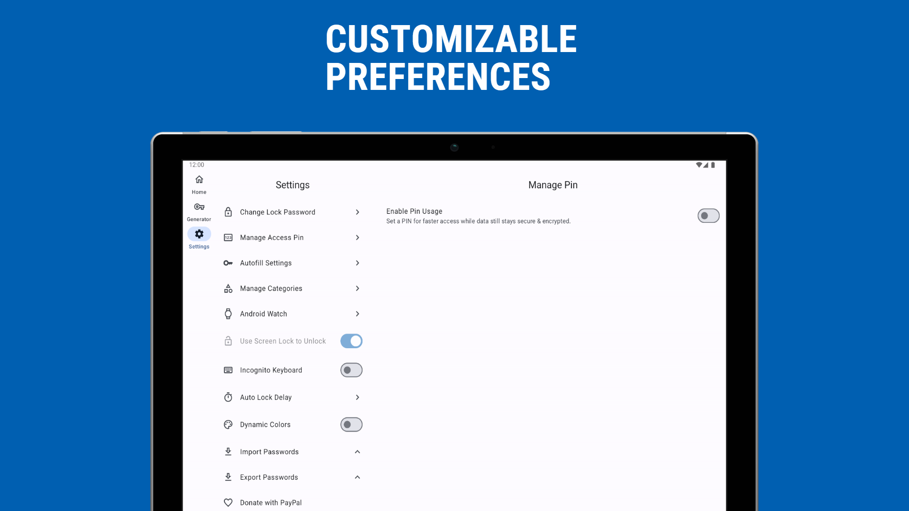 |
| 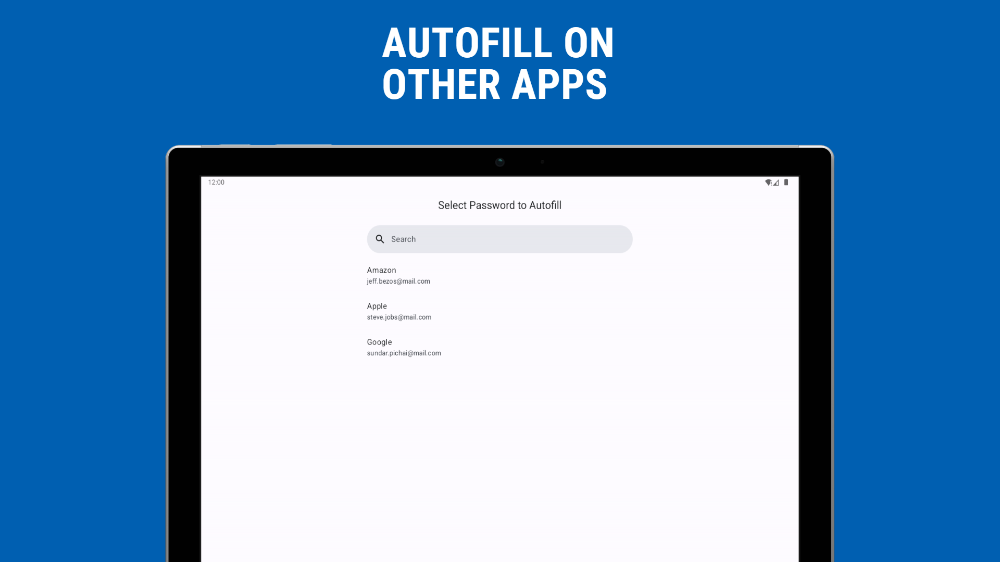 |

## Screenshots (Wear OS) ⌚

| | | |
|---|---|---|
| 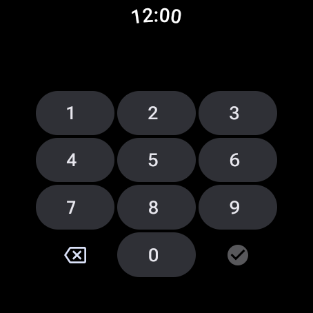 | 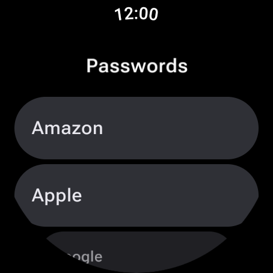 | 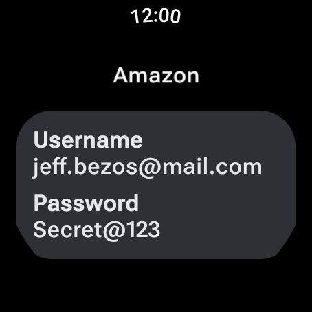 |

## Links 🔗

